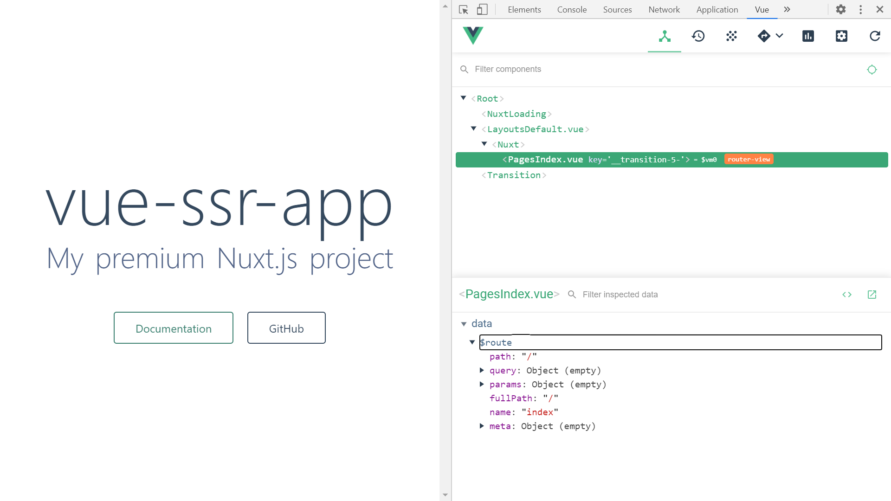

# :zap: view-ssr-app

* Vue app created with Nuxt, using Server Side Rendering (SSR), Bulma CSS framework and Docker to create a Google CloudRun project
* **Note:** to open web links in a new window use: _ctrl+click on link_


## :page_facing_up: Table of contents

* [General info](#general-info)
* [Screenshots](#screenshots)
* [Technologies](#technologies)
* [Setup](#setup)
* [Features](#features)
* [Status](#status)
* [Inspiration](#inspiration)
* [Contact](#contact)

## :books: General info

* NUXT used to create app with SSR etc. already set up

## :camera: Screenshots



## :signal_strength: Technologies - Frontend

* [Vue v4](https://vuejs.org/)
* [Vue.js devtools chrome extension](https://chrome.google.com/webstore/detail/vuejs-devtools/nhdogjmejiglipccpnnnanhbledajbpd?hl=en)
* [Nuxt v2](https://nuxtjs.org/) Vue framework
* [Bulma](https://bulma.io/) CSS framework
* [Express v4](https://expressjs.com/)

## :floppy_disk: Setup - Frontend

* Install dependencies using "npm install"
* Run `npm run dev` to serve with hot reload at localhost:3000
* To build for production and launch server: run `npm run build` then `npm run start`
* To generate static project run `npm run generate`

## :computer: Code Examples - Frontend

* extract from

```javascript

```

## :cool: Features

* N/A

## :clipboard: Status & To-Do List

* Status: Very basic, working Vue SSR app. Logo commented out to avoid error. Docker image creating failed - issues with Docker running on my Oracle Virtualbox.
* To-Do: Fix logo error, try cloud Docker

## :clap: Inspiration

* [Fireship:  Cloud Run QuickStart - Docker to Serverless](https://www.youtube.com/watch?v=3OP-q55hOUI)

## :file_folder: License

* This project is licensed under the terms of the MIT license.

## :envelope: Contact

* Repo created by [ABateman](https://github.com/AndrewJBateman), email: gomezbateman@yahoo.com
